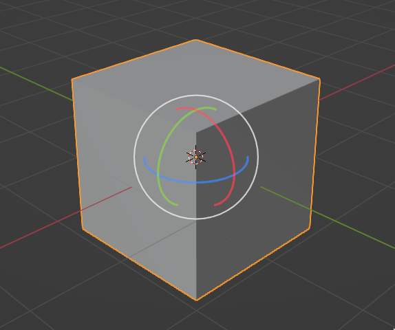
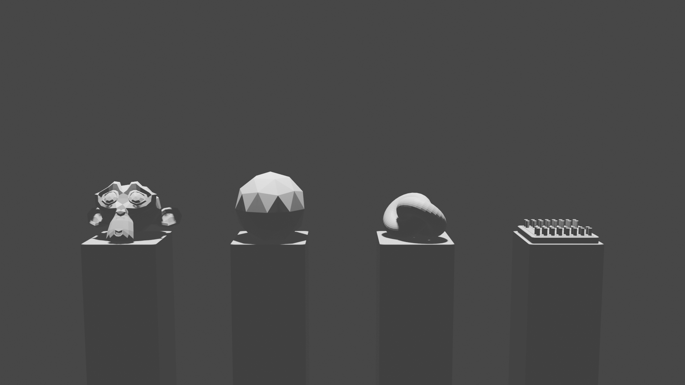

# Blender Workshop

## What is Blender ?

Blender is a free and open source 3D creation suite. It supports the entirety of the 3D pipeline—modeling, rigging, animation, simulation, rendering, compositing and motion tracking, even video editing, 2D animation and game creation.

In this workshop, you will familiarize yourself with the basics of Blender. You will learn how to navigate the interface, understand what tools you have at your disposition, creating and editing meshes, and finally render a scene.

> *Note: 3D Modeling takes time, patience and practice. Don't be discouraged if you don't get it > right away. It's normal to struggle at first. Just keep practicing and you'll get better.
> You can check this [Official Blender 2.80 Tutorial](https://www.youtube.com/watch?v=MF1qEhBSfq4&list=PLa1F2ddGya_-UvuAqHAksYnB0qL9yWDO6 "Even if we are using version 3.5, this tutorial is still pretty relevant") if you want to go further*

So let's get started !

The first time you will launch Blender, you will face something like this

We can see the version of Blender we are using in green (make sure you are at least on 2.80) and
other button, for this workshop, we don't need to worry about them. So let's start by clicking **General**

After you click this you will see this

So now, ***DO NOT TOUCH ANYTHING***, Blender has a lot of hotkeys and it can be really confusing at first. So let's start by learning the basics.

This is the main interface of Blender. It's composed of 4 main parts:
- **The 3D Viewport** (where you will spend most of your time)
- **The Outliner** (where you can see all the objects in your *Scene*)
- **The Properties** (where you can change the properties of your objects)
- **The Timeline** (where you can see the animation of your scene)

There are also the Workspace above, but i will explain them later.

I highlighted the different part here

## The 3D Viewport

The 3D Viewport is where you can see your scene. There is a lot of things to see here, but let's start slowly.

How do you navigate in this infinite space ?  
You can use your mouse (I hope you bring one):
- **Middle Mouse Button** to rotate the camera
- **Scroll Wheel** to zoom in and out
- **<kbd>Shift</kbd> + Middle Mouse Button** to pan the camera

You can also see a Gizmo in the top-right corner of the 3D Viewport.

You can click on any of his axis to set the camera along this axis. You can also click and drag to rotate the camera.

And if you are lazy, you can use Hotkeys to navigate:
- <kbd>Numpad 3</kbd> to set the camera along the X Axis
- <kbd>Numpad 1</kbd> to set the camera along the Y Axis
- <kbd>Numpad 7</kbd> to set the camera along the Z Axis
- <kbd>Ctrl</kbd> + <kbd>Numpad 3</kbd> to set the camera along the -X Axis
- <kbd>Ctrl</kbd> + <kbd>Numpad 1</kbd> to set the camera along the -Y Axis
- <kbd>Ctrl</kbd> + <kbd>Numpad 7</kbd> to set the camera along the -Z Axis

Okay so we can navigate in the Viewport now, what now ?

We can now start to select the **Almighty Default Cube**, to do so you can simply Right Click on it.  
To deselect it, you can Right Click on an empty space in the Viewport.  
You can see the object you have selected with an orange outline.  

 

> You can select multiple objects by holding <kbd>Shift</kbd> and Right Clicking on them.  
> Note that when you select multiple objects, the last object you select will be the **Active Object**.  
> You can use the hotkey <kbd>A</kbd> to select/deselect all objects in the scene.

Now that we have selected our mesh, we can start to transform it.
> Huh? a Mesh? What is that ?

Oh right, i owe you an explanation

## Vertex, Edge, Faces, Mesh... what are those ???

### Vertex
A vertex is a point in space.

### Edge
An edge is a line between two vertices.

### Face
A face is a flat surface enclosed by edges.

### Mesh
A mesh is a collection of faces, edges, and vertices that define a 3D object.

> *I will come back on how you can select these independently later*

So now that we have selected our mesh(or cube), we can start to transform it.

## Transforming our Cube

Let's quote Wikipédia for what is a Transformation

> *In mathematics, a geometric transformation is any bijection of a set to itself (or to another > such set) with some salient geometrical underpinning.*

Huh... what ?

Okay basically a transformation is a way to change where or how your object will appear in the Viewport.

In Blender, you can transform your object in 3 ways:
- **Translation** (Moving your object)
- **Rotation** (Rotating your object)
- **Scale** (Scaling your object)

There are multiples way you can transform your object, but the most common way is to use the **Gizmo**.

No, not this one.

This one.

> *Wait, how did you do that ?*

You can achieve this by clicking on the **Move** button in this menu

> *If you don't see this menu, press <kbd>T</kbd> to toggle it*  
> *You can also press <kbd>Shift</kbd> + <kbd>Space</kbd> to open the quick menu*

You can now click on any Axis to move your object along.  
You can also see that there is 3 little square opposed to the axis, this allow you to move freely in the 3D space **except** on the opposite axis.  
If you click on the green square (Y axis) for exemple, you can move freely on the X and Z axis, but not on the Y axis.  
You can also click on the white circle to move freely in the 3D space.

> *The hotkey <kbd>G</kbd> (Grab) allow you to move your object in the 3D space along the view axis*

You will notice that there is still 3 buttons left, these are the **Rotation**, **Scale**  and **Transform** buttons.

Although the Gizmo can look different, the way you use them is the same.

> *Rotate Gizmo*

> *Scale Gizmo*

> *Transform Gizmo*  
> *Note that the Transform Gizmo is only a combination of all three Gizmo*

> *The hotkey <kbd>R</kbd> (Rotate) allow you to rotate your object in the 3D space along the view axis  
> The hotkey <kbd>S</kbd> (Scale) allow you to scale your object along all axis*

So now you know how you can move object freely in the 3D space.

But this cube is kinda lonely, let's add some friends.

## Adding Objects

To add an object, you can press <kbd>Shift</kbd> + <kbd>A</kbd> to open the Add menu.

Woah, there is a lot of things here, I won't go through all of them, but let's see the most common ones:
- **Mesh** (Add a mesh to the scene)
- **Light** (Add a light to the scene)
- **Camera** (Add a camera to the scene)

Since we want to add some friends for our cube, let's add a **Mesh**.

You can see that there is a lot of different mesh you can add:
- **Plane** (A plane)
- **Cube** (A cube)
- **Circle** (A circle)
- **UV Sphere** (An UV sphere)

- **Ico Sphere** (An Ico sphere)

> *An Ico sphere is a n-subdived Icosahedron with the vertices projected onto the sphere*

- **Cylinder** (A cylinder)
- **Cone** (A cone)
- **Torus** (A torus)
- **Grid** (A plane but with subdivisions, useful for terrain, cloth simulation, etc...)
- **Monkey** (A monkey ?)

> *This monkey is Suzanne, this is a basic model in Blender to test Material, Rigging, Animation, Lighting, etc...*

Now let's add a **Cube**, if you moved the previous cube, you will see another cube pop up in the center of the 3D Space.

> *If you don't see the cube, try to move it out of the way, it might be hidden inside the other cube*

If you have really sharp eye, you will notice that when you add an **Object**, it will be selected by default.  
You can also see that there is a small menu on the bottom left of the Viewport.

If you click on it, you will see something like this

This is the **Operator Panel**, it allow you to change the properties of the object you are adding.

It will depends on the object you are adding but you can usually change the **Size** of the object, the **Rotation** and the **Location**.

> ***Generate UVs** is a bit more complicated, we will see this in the next part*

Actually, I lied about the fact that when you add an **Object**, it will be in the center of the 3D space.  
You might have noticed that there is a cursor in the center of the 3D space.

This is the **3D Cursor**, it's a point in space that you can use to place your Object.  
When you add an Object, it will be placed at the **3D Cursor** location.  
You can use <kbd>Shift</kbd> + Right Click to place the **3D Cursor** anywhere in the 3D space.

> how can I set the 3D Cursor to his original place ? <kbd>Ctrl</kbd> + <kbd>Z</kbd> doesn't work

You can use the **Snap** menu to snap the **3D Cursor** to the **Origin** of the **Scene**.
> What is the **Snap** Menu ?

The **Snap** Menu is a menu that allow you to efficiently place the **3D Cursor** and **Objects** in the 3D space.  
You can toogle it using <kbd>Shift</kbd> + <kbd>S</kbd>.

There is a lot of option there, I will let you discover them by yourself, for now select **Cursor to World Origin**.

Okay, you know how to add **Objects**, how to select and transform them, let's do an exercise.  
Try to do a construction of your choice using any **Mesh** you want. here's a simple example.

---

## The Modeling Workspace

Okay, now that you know how to add and transform **Objects**, let's see how we can **edit** them.

The goal here is to have something like this.

Okay don't panic, it's actually not that hard.

First, let's start over with a new **Scene**. Just press <kbd>Ctrl</kbd> + <kbd>N</kbd> to open a new **Scene** (select **General**)

Now let's go another Workspace, the **Modeling** Workspace.

You see that the workspace are in the top bar of the interface.

We are currently in the **Layout** Workspace, this workspace is made so we can easily navigate in the **Scene** and add **Objects**.  
Let's head to the next Workspace, the **Modeling** Workspace.

In this workspace, you can change how your mesh will look like, you can add Vertices, Edges and Faces, but you can also transform or delete them.

Let's try it out, now our cube is fully selected, let's try to select only one **Vertex**.
> Remember how to select ?

If you done it right, you should see something like this.

Now that we have selected a **Vertex**, you can transform it just like with out cube.

> *Scaling and rotating won't do a thing since it's just a point in space*

You can select multiple **Vertices** too transform them all at once.
> Remember how to select multiple objects ?

> Okay that's fun and all, but how can we add **Vertices**, **Edges** and **Faces** ?

Okay let's start with the **Vertex**, you can add a **Vertex** by pressing <kbd>Ctrl</kbd> + <kbd>Left Click</kbd> on the **Mesh**.

> *If you do this when you have selected a **Vertex**, it will **extrude** the **Vertex** instead*

> But it will take ages to get a table like this !

You are right, but there is a way to modify your **Mesh** more efficiently, let's look at the **Tools** menu.
> Do you know where is it ?

I will explain what these 5 tools since there are simple and we don't need to go that far.

- **Extrude Tool** <kbd>E</kbd>: This tool will add **Vertices**, **Edges** and **Faces** and connect them to the selected **Vertices**, **Edges** and **Faces**.

- **Insert Face** <kbd>I</kbd>: This tool will add a **Face** between the selected **Vertices**, they must form a Face.

- **Bevel** <kbd>Ctrl</kbd> + <kbd>B</kbd>: This tool will add a **Bevel**, meaning that it will soften the **Vertices** or **Edges**.

- **Loop Cut** <kbd>Ctrl</kbd> + <kbd>R</kbd>: This tool will cut a **Loop** in your **Mesh**.

- **Knife** <kbd>K</kbd>: This tool will cut your **Mesh**.

Experiment with these tools a bit, and try to understand how I made the table.  
Don't hesitate to ask for help if you didn't understand something.

---

If you manage to get the table (no need to be ***exactly*** the same), we can move on to deleting **Vertices**.

You can delete a **Vertex** by selecting it and pressing <kbd>X</kbd> or <kbd>Delete</kbd>.

You will see the Delete menu, but it will look different than before.

Let's see what these options do:

- **Vertices** <kbd>V</kbd>: Delete the selected **Vertices**, but will also delete all the **Edges** and **Faces** connected to them.
- **Edges** <kbd>E</kbd>: Delete the selected **Edges**, but will also delete all the **Faces** connected to them, but will not delete any **Vertices** that share another unselected **Edge**.
- **Faces** <kbd>F</kbd>: Delete the selected **Faces**, but will not delete any **Vertices** or **Edges** that share another unselected **Face**.
- **Only Edges & Faces** <kbd>O</kbd>: Combine **Faces** and **Edges** deletion, but will keep your **Vertices** intact, even if there are not connected.
- **Only Faces** <kbd>N</kbd>: Like **Faces** deletion, but will keep your **Edges** intact.
- **Dissolve Vertices** <kbd>D</kbd>: Try to modify the geometry of your Mesh in a way to act like the **Vertices** didn't exist at all, this will not always work as intended.
- **Dissolve Edges** <kbd>I</kbd>: Try to modify the geometry of your Mesh in a way to act like the **Edges** didn't exist at all, this will not always work as intended.
- **Dissolve Faces** <kbd>S</kbd>: Try to modify the geometry of your Mesh in a way to act like the **Faces** didn't exist at all, this will not always work as intended.
- **Collapse** <kbd>C</kbd>: Collapse will try to merge the selected **Vertices** into one.
- **Edge Loops** <kbd>G</kbd>: Will collapse the selected **Edge Loop** into the nearest **Edge Loop**, this is a way to cancel out a Face extrusion.
> Edge Loop are when **Vertices** or **Edge** are connected to each other in a loop.

So now that you know how to delete **Vertices**, let's do an exercice.  
With all that you learned so far, try to obtain the same result has me.

### Rendering

Okay, now that we have our **Mesh**, let's render it.

To properly render out **Mesh**, we will need a **Camera** and a **Light** (optional, but it's better if we can see your work under the spotlight)

You might have noticed when you were navigating through the **Workspace** that there is already **Camera** and a **Light** in the **Scene**.

If you press <kbd>Numpad 0</kbd>, you will jump through the **Camera** view.  
This view is exactly what is is, the view of the **Camera**, meaning that when you will render your **Scene**, it will render what you see in this view.

But there is something wrong here, our Cube looks kinda flat, and the **Light** doesn't affect it.  
That's because we are in the **Solid** mode, this mode is made so we can add, edit and transform **Objects** without consuming ressource from the CPU.  
There are 4 four Mode:
- **Wireframe** (Show only the **Wireframe** of the **Mesh**)
- **Solid** (Show the **Mesh** with a solid color)
- **Material Preview** (Show the **Mesh** with the **Material** applied to it)
- **Rendered** (Show the **Mesh** with the **Material** and **Light** applied to it)

How can we change it ?  
There is a little bar in the top right corner of the **Viewport**.

You can click on it to change the **Viewport** mode.  
You can also press <kbd>Z</kbd> to open a quick menu to change the **Viewport** mode.

So let's go to the **Rendered** mode.

You can see that the shadow moved, and if you move the **Light** you can see that it will affect the **Mesh**.

How can we render our **Scene** now ?  
You can go to the **Render** menu in the top bar of the interface, and then select **Render Image**, or you can press <kbd>F12</kbd>.

This will open a new window with your **Scene** rendered.

The image has been saved in the /tmp/ folder if you are on Linux, but you can click on **Image** > **Save As** to save it anywhere you want.

So this is it, you know how to navigate through the viewport, you know how to add, edit and transform **Objects** and you know how to render your **Scene**.  
You can now try to render your own scene, or you can try to do this scene.  
If you want, you can also read below this part to learn how to use **Modifiers**.

> The last element is a chessboard

---

## Modifiers

This is the optional part of this workshop, and it's not necessary to make pretty things, but it can be really useful.

What is a modifier ?

A modifier is another way to modify your **Mesh** by applying a **Modifier** to it, this modifier can add or edit the geometry of your **Mesh**, but can also apply more complex effect only showable in animation.
Seems obvious right ?  
Since now, we have modified our **Mesh** by using tools and transform.
Modifiers can do that too, but they also allow use to make powerful changes to our **Mesh**.

> Copy of the same cube using the **Array** modifier

> A mesh with the **Mirror** modifier

> A cube with the **Wireframe** modifier

> A grid with the **Wave** modifier

So, where do we start ?

We will head into the Properties Panel.

You can see that there is a lot of different tabs here, so let's quickly see what they do, but I will not explain what you can do.

- The Tool Options helps you to access the options of the tools you are using.
- The Render Tab allows you to change the render settings of your scene, like ambient Occlusion, Bloom, etc...
- The Output Tab allow you to change the output settings of your render, like the resolution, the file format, etc...
- The View Layer Tab allow you to change the settings of your view layer, like the visibility of the objects, the renderability, etc...
- The Scene Tab allow you to change the settings of your scene, like the units, the gravity, etc...
- The World Tab allow you to change the settings of your world, like the color, the lighting, etc...
- The Collections Tab allow you to change the settings of your collections (depending on your version, you might not have this tab).
- The Object Tab allow you to change the settings of your objects, like the location, the rotation, etc...
- The Modifier Tab allow you to add, edit and remove modifiers from your objects.
- The Particle Tab allow you to add, edit and remove particles from your objects.
- The Physics Tab allow you to add, edit and remove physics from your objects.
- The Constraints Tab allow you to add, edit and remove constraints from your objects, for example, you can make an Object move with another Object by constraints on their position.
- The Object Data Tab allow you to change the settings of your objects data, like the shape of a mesh, the shape of a curve, etc...
- The Material Tab allow you to add, edit and remove materials from your objects, we will come back to this on the next Workshop.
- The Texture Tab allow you to add, edit and remove textures from your objects, we will come back to this on the next Workshop.

So, of course we will focus on the **Modifier** Tab.

Let's add a Modifier

Of course i won't explain what all 54 of them do, I will only explain the ones I know.  
Note also that i will not explain all the feature they have.

> Some modifier need to be applied before you can see the difference.  
> You can apply a modifier by pressing <kbd>Ctrl</kbd> + <kbd>A</kbd> on the modifier you want to apply.

### Array

The **Array** modifier allow you to duplicate your **Mesh** in a certain direction.

- **Fit Type**: The way the **Mesh** will be duplicated.
  - Fixed Count: The **Mesh** will be duplicated a certain amount of time.
  - Fit Length: The **Mesh** will be duplicated until it reach a certain length.
  - Fit Curve: The **Mesh** will be duplicated until it reach the end of a curve.
- **Relative Offset**: The offset between each **Mesh**.
- **Constant Offset**: The **Mesh** will be duplicated with a constant offset.
- **Object Offset**: The **Mesh** will be duplicated with an offset relative to another object.

### Bevel

The **Bevel** modifier allow you to apply a Bevel on your **Mesh**, this is like the Bevel Tool.

- **Width Type**: The way the **Bevel** will be applied.
  - Offset: The **Bevel** will be applied with a certain offset.
  - Width: The **Bevel** will be applied with a certain width.
  - Depth: The **Bevel** will be applied with a certain depth.
  - Percent: The **Bevel** will be applied with a certain percent.
  - Absolute: The **Bevel** will be applied with a certain absolute value.
- **Amount**: The amount of **Bevel** to apply.
- **Segments**: The amount of segments of the **Bevel**.
- **Limit Method**: The way the **Bevel** will be limited.
  - Angle: The **Bevel** will be limited by an angle.
    - **Angle**: The angle of the Bevel Limit

### Boolean

The **Boolean** modifier allow you to apply a boolean operation on your **Mesh**.

- **Operation**: The boolean operation to apply.
  - Intersect: The **Mesh** will be modified to only keep the intersection between the two **Mesh**.
  - Union: The **Mesh** will be modified to keep the union between the two **Mesh**.
  - Difference: The **Mesh** will be modified to keep the difference between the two **Mesh**.
- **Operand Type**: The type of the second **Mesh**.
  - Object: The second **Mesh** will be another object.
  - Collection: The second **Mesh** will be a collection of objects.
- **Solver**:
  - Fast: The **Boolean** operation will be faster, but some vertices might be missing.
  - Exact: The **Boolean** operation will be slower, but all the vertices will be there.

### Build

The **Build** modifier allow you to animate the appearance of your **Mesh**.

- **Start Frame**: The frame where the **Mesh** will start to appear.
- **Length**: The length of the animation.
- **Reversed**: The animation will be reversed.
- **Randomize**: The animation will be randomized.
    - **Seed**: The seed of the randomization.

### Decimate

The **Decimate** modifier allow you to reduce the amount of **Vertices** of your **Mesh**, but try to keep the same shape as much as possible.

> The Torus on the Right has less vertices than the one on the left

- **Ratio**: The ratio of the **Vertices** to keep.
- **Triangulate**: The **Mesh** will be triangulated.

### Edge Split

The **Edge Split** modifier allow you to split the **Edges** of your **Mesh**.

- **Edge Angle**: The angle where the **Edges** will be split.

### Mirror

The **Mirror** modifier allow you to mirror your **Mesh**.

> The UV Sphere on the right is a mirror of the one on the left

- **Axis**: The axis where the **Mesh** will be mirrored.

### Subdivision

The **Subdivision** modifier allow you to subdivide the face of your **Mesh**.

- **Subdivision Type**: The type of subdivision to apply.
  - Simple: The **Mesh** will be subdivided.
  - Catmull-Clark: The **Mesh** will be subdivided using the Catmull-Clark algorithm.
- **Levels Viewport**: The amount of subdivision to apply in the viewport.
- **Render**: The amount of subdivision to apply in the render.

### Remesh

The **Remesh** modifier allow you to remesh your **Mesh**, it will be modified so that the result contains only quads

- **Mode**: The mode of remeshing to apply.
  - Blocks: The **Mesh** will be remeshed using blocks.
  - Smooth: The **Mesh** will be remeshed using smooth.
  - Sharp: The **Mesh** will be remeshed using sharp.
  - Voxel: The **Mesh** will be remeshed using voxels.

### Screw

The **Screw** modifier allow you to take a profile **Mesh** and generate a Helix/Screw Shape.

- **Angle**: The angle of the screw (360° meaning 1 iterations will rotate 360° along the axis).
- **Screw**: The amount of screw (how far along the axis 1 iterations will go).
- **Iterations**: The amount of iterations.
- **Axis**: The axis
- **Steps**: The amount of steps.

aaand I will stop there, if you want to see more, you can see this [video](https://youtu.be/idcFMhoSdIc "Pretty cool")

When you know how to use modifiers, you can do stuff like this:

Of course you could have done this only with tools, but it would have taken way more time.
